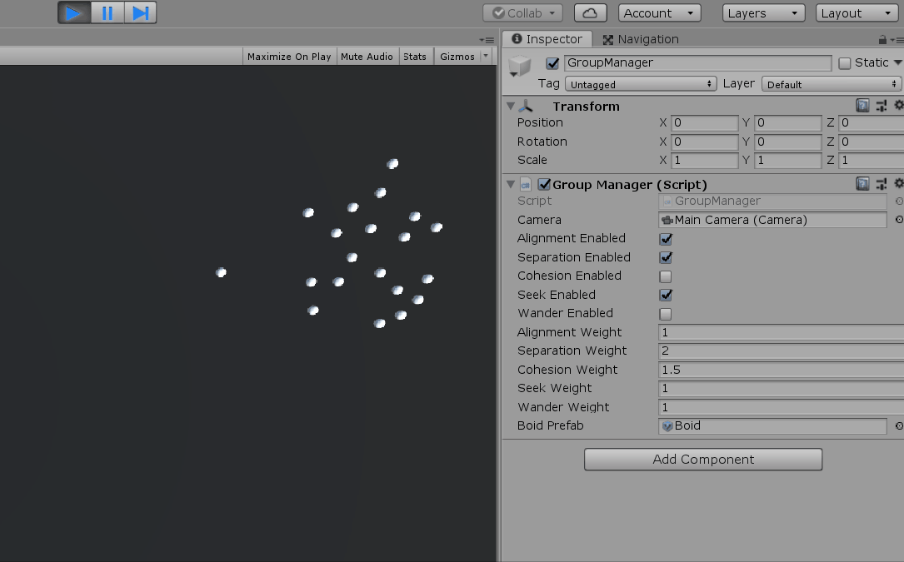

# Steering Behavior Demo: Spherical Boids

A simple project to demonstrate the following steering behaviors, as defined by [Craig Reynolds](https://www.red3d.com/cwr/steer/gdc99/):

- Separation
- Alignment
- Cohesion
- Seeking

Simply run the project and enable/disable the behaviors you want to see in the GroupManager's inspector pane. Here's an example with alignment, separation, and seeking turned on (and cohesion turned off):

